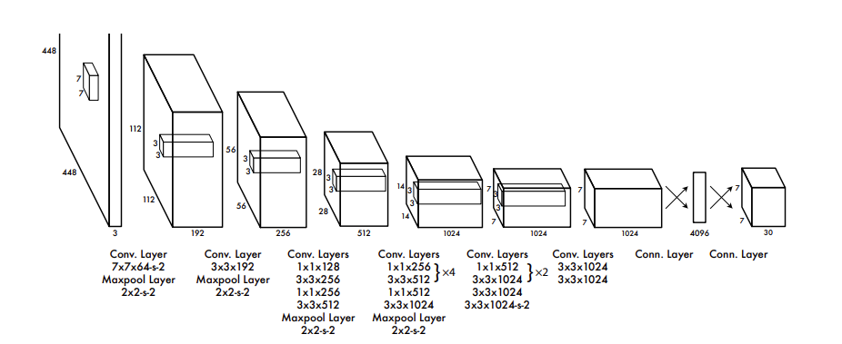
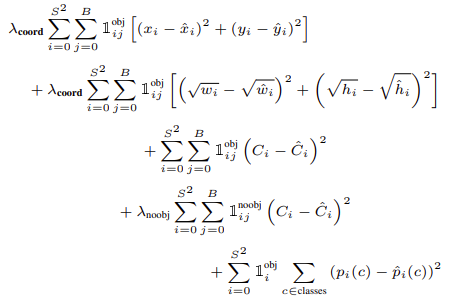
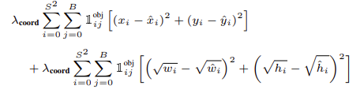
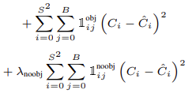
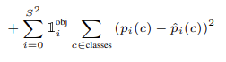
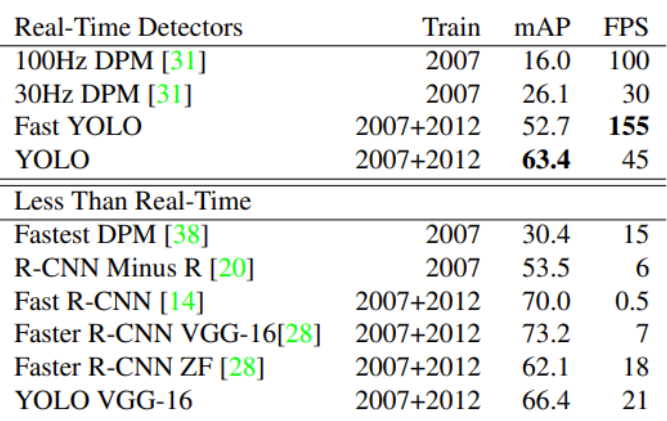
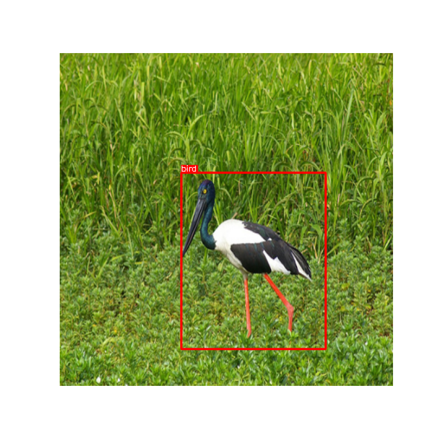
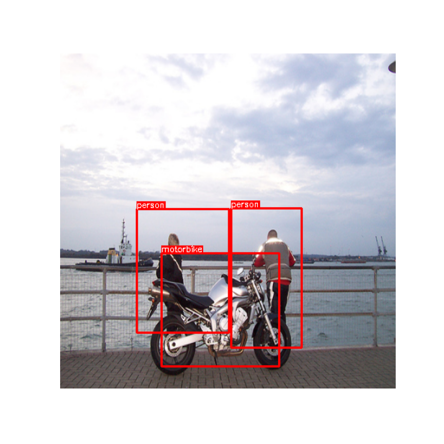
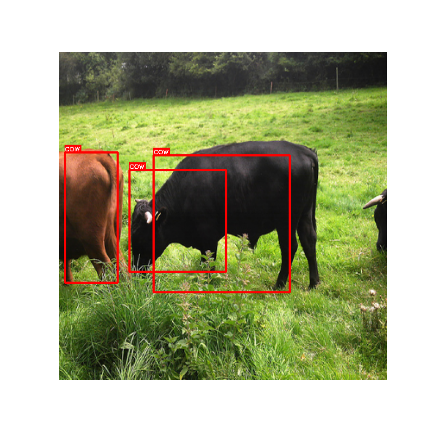
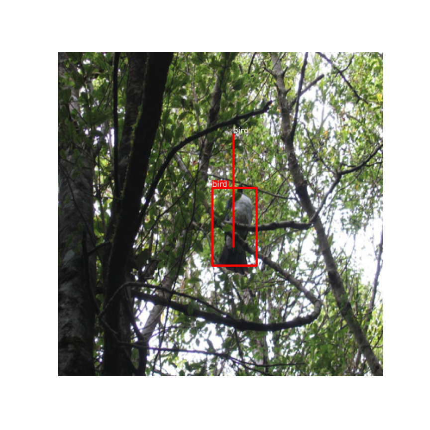

# YOLO (You Only Look Once)

### Introduction
- Detection과 Classification문제를 하나의 regression 문제로 정의
  - 하나의 신경망으로 탐지와 분류를 동시에 수행 (Unified Detection)
    
    
- 기존 실시간 Detection 모델에 비해 높은 성능 + 빠른 속도 (45 frame pre second)
- 다른 도메인에서도 좋은 성능을 보여준다.
  - Pascal Voc 2007로 학습한 YOLO를 사용해 예술 작품 데이터셋으로 테스트했을 때 정확도가 다른 Detection모델에 비해서 적게 떨어짐

### Unified Detection
- YOLO는 Input Image를 S x S의 Grid 로 나눈다. 
  - 물체의 중심을 포함하는 Grid Cell이 해당 물체를 감지한다.
- 각 Grid Cell은 B개의 Bounding Box를 가진다.
  - 각 Bounding box는 다음 5개의 예측으로 구성된다.
    1. x, y : 예측한 bounding box의 중심좌표 (grid cell에 상대적, 0.5 0.5라면 grid의 중심)
    2. w, h : 예측한 bounding box의 width, height (전체 이미지 크기에 대한 비율)
    3. confidence score : Pr(object) * IOU(ground truth, predict)
- 각 Grid Cell은 n개의 클래스를 예측하는 확률을 가지고있다. 
- 논문에서 S는 7, B는 2, n은 20이다.
  - Output Tensor가 (7 x 7 x 30)인데 7 x 7은 각 Grid Cell을 의미한다.
  - 30은 각 Grid Cell이 예측한 정보로 2개의 bounding box의 예측, class 확률을 나타낸다.
  - 즉 [x, y, w, h, con][x, y, w, h, con][20개 클래스에 대한 확률] 이다.
- Network Design
  - 24개의 Conv layer
  - Input : 448 x 448 x 3
  - Output : 7 x 30 x 30
   
    

- Train
  - Pretrain
    - Network의 앞의 20개의 Conv Layer는 Avg Pool Layer, Linear Layer를 붙혀 ImageNet 1000 Classification으로 Pretrain한다.
    - Pretrain이 끝난 뒤 Avg pool, Linear Layer를 제거하고 Conv Layer 4개와 2개의 Linear Layer을 붙혀 yolo모델을 학습한다.
  - Dataset
    - Pascal Voc 2007
    - Pascal Voc 2012
  - Activation Function
     -  마지막 출력과 각 Layer 사이마다 leakyReLU(alpha = 0.1)를 사용
  - Avoid overfitting
    - Dropout(0.5)을 첫 번째 connceted Layer 뒤에 적용한다.
    - data augmentation
      - random scaling and translations of up to 20% of the original image size
      -  randomly adjust the exposure and saturation of the image by up to a factor of 1.5 in the HSV color space.
   - Learning rate
     - 총 135 epoch 중 75 epoch까지는 1e-2, 75 ~ 105 epoch까지는 1e-3, 105 ~ 135 epoch까지는 1e-4를 사용

- Loss function
    
    
    - 총 5개의 식으로 loss를 계산한다.
    - 각 loss들은 SSE를 사용한다.
    - Loss를 계산할 때 B개의 box를 모두 사용하지 않고 predictor로 선택된 bounding box만 사용한다.
      - predictor란 Ground Truth와 IOU가 더 큰 box를 말한다. 
    - 보통 object가 있는 Grid Cell보다 없는 Grid Cell이 더 많다.
      - 이를 해결하기 위해 lambda_coord(5), lambda_noobj(0.5)를 제시하였다.
    - Localization loss
        
        
      - 위의 식의 indicator는 i번 Cell에 j번 bounding box가 predictor라면 1, 아니면 0인 값이다. 
      - w, h에 루트를 사용하는 이유는 큰 box에 대해서 작은 분산을 반영하기 위해서다.
    - Confidence loss

        
      - 오브젝트가 존재하는곳, 오브젝트가 존재하지 않는 곳의 confidence loss를 계산한다.
    - Classification loss

        
      - 오브젝트가 존재하는 곳에 대해서만 Classification loss를 계산한다.

- Comparison to Other Detection System

    

    - Real-Time Detector에 대해서 성능 속도면에서 더 좋은것을 볼 수 있다.
      - Fast Yolo의 경우 앞의 20개의 Conv Layer대신 9만 사용한 모델이다.

# Implementation

- data directory 구조
  ```
  data
  ├── _train
  │   ├── Annotation 
  │   └── Image
  └──_valid
     ├── Annotation
     └── Image
  ```
    
  - train : PASCAL Voc 2007 (train + test), PASCAL Voc 2012 (train)
  - valid : PASCAL Voc 2012 (valid)

- Loss function
  - Label자체를 predict와 똑같은 shape이 되도록 작성하였기 때문에 필요한 부분만 SSE를 사용해 계산
- Pretrain
  - model을 만들어 놓기는 했는데 Image net Data 크기가 너무 커서 포기
  - torchvision.model의 GooLeNet pretrain된 모델을 사용
- 결과 (Image)
  - 학습이 끝난 후 Valid Data출력 확인
  - Good
     
  - Bad
     
- 논문과 다르게 구현한 곳
  - Activation Function
    - 논문에서는 leakyReLU를 사용하였지만 width, height Loss를 계산할 때 sqrt를 해야해서 relu로 변경
    - pretrain model을 GoogLeNet 그대로 사용
- 개선 혹은 수정 해야할곳
  - 학습 속도 관련
    - Dataset에서 label을 만들어주지 않고 미리 파일로 만들어놓고 하면 속도가 더 빨라질 수 있을것 같음
  - 성능 관련
    - box의 크기가 정확하지 않거나 조금씩 밀려있는 경우가 있다.
      
      -> Loss function을 조금 더 개선해야 할 것 같다.

    - 같은 객체를 서로 다른 box로 잡아내는 경우가 많다.
      
      -> NMS, getbox부분 box의 width, height가 너무 작은 경우 무시하도록 개선해야할 것 같다.
  